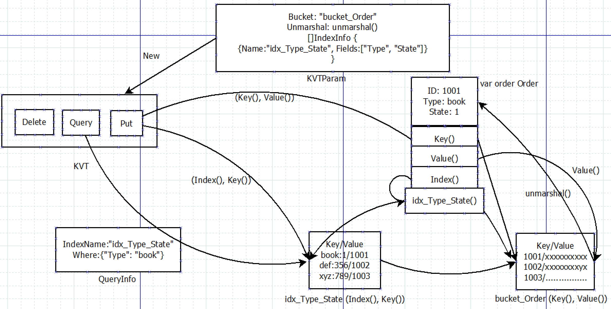

KVT is a pure GO index manager lib for indexing key-value based objects

define index with some funcs and a struct, KVT will auto maintain the index when you CRUD it

the most important is you can query with KVT by the index you define, just as sqlite or other database system do for you

KVT is NOT a KV system, it's a index manager only, its aim is to integrate with all other database based KV 

Now support KV lists:  BoltDB, BuntDB, Redis...


Features
========

- support union index, one field or multi fields
- index support full compare query(=,<, >...), range query
- index support all data type(int, string, time...) 
- support multi indexs for one struct
- support partial index query(you can omit some index fields)
- support slice index(contain query with midx)
- KVT self depends on reflect package few, only a check when init, but maybe your APP code need depend reflect when marshal/unmarshal
- support many kv DB, it will very easy to add a new kv driver, now tested BoltDB/BuntDB/Redis 
- support spec data/index bucket path
- most import, very easy to use and integrate with other code


flow
========



install
========
```
go get github.com/simpleKV/kvt 
```
then build you project with One driver build tag: boltdb/buntdb
```
go build -tags boltdb   //build with boltdb, if you want use BoltDB
go build -tags buntdb   //build with buntdb  if you want use BuntDB
go build -tags redis    //build with redis  if you want use Redis
```

sample
========
here is a simple sample:
```
package kvt_test

import (
	"bytes"
	"encoding/gob"
	"fmt"
	"github.com/simpleKV/kvt"
	"log"
	"unsafe"

	bolt "go.etcd.io/bbolt"
)

type Order struct {
	ID     uint64
	Type   string
	Status uint16
	Name   string
	Num    int
}

var (
	kvOrder *kvt.KVT
	bdb     *bolt.DB
)

func order_pk_ID(obj interface{}) ([]byte, error) {
	c := obj.(*Order)
	return kvt.Bytes(kvt.Ptr(&c.ID), unsafe.Sizeof(c.ID)), nil
}

// a union index function: Type and Status
func order_idx_Type_Status(obj interface{}) ([]byte, error) {
	c, _ := obj.(*Order)
	ret := kvt.MakeIndexKey(nil, []byte(c.Type), kvt.Bytes(kvt.Ptr(&c.Status), unsafe.Sizeof(c.Status)))
	return ret, nil
}

// encode should match with decode, here we use gob, you can use json as you like
// generater []byte to save you obj into kv db
func order_valueEncode(obj interface{}) ([]byte, error) {
	var network bytes.Buffer // Stand-in for the network.
	// Create an encoder and send a value.
	enc := gob.NewEncoder(&network)
	c, _ := obj.(*Order)
	enc.Encode(c)
	return network.Bytes(), nil
}

// unmarshal []byte to your obj
func order_valueDecode(b []byte, obj any) (any, error) {
	r := bytes.NewReader(b)
	dec := gob.NewDecoder(r)
	var c *Order
	if obj != nil {
		c = obj.(*Order)
	} else {
		c = &Order{}
	}
	dec.Decode(c)
	log.Println("decode Order:", c)
	return c, nil
}

func initOrder() {
	kp := kvt.KVTParam{
		Bucket:    "Bucket_Order",
		Marshal:   order_valueEncode,
		Unmarshal: order_valueDecode,
		Indexs: []kvt.Index{
			//pk is primary key, it is necessary, you can't omit it, it support union fields too
			//you MUST NEVER NEVER NEVER update/modify the pk of a object
			{
				&kvt.IndexInfo{Name: "pk_ID"},
				order_pk_ID,
			},
			//self define index, 3 key infos: index name,  index fields and index function
			//fields is optional, will parse from index name when omitted, fields should match with the struct field name
			//index has 3 types, primary key(prefix "pk_"), common index("idx_"), multi index with prefix "midx_"
			//index name is arbitrary except the prefix, if you supply index fields
			//index function  name is arbitrary, match with index is a better choice
			{
				&kvt.IndexInfo{
					Name: "idx_Type_Status",
					//Fields: []string{"Type", "Status"}, //Fields is optional, when omit, will parse from the index name
				},
				order_idx_Type_Status,
			},
		},
	}
	var err error
	kvOrder, err = kvt.New(Order{}, &kp)
	if err != nil {
		fmt.Printf("new kvt fail: %s", err)
		return
	}
	bdb, err = bolt.Open("kvt_test.bdb", 0600, nil)
	if err != nil {
		return
	}

	/* //here create the Order/index buckets, you only need run it for the first time
	bdb.Update(func(tx *bolt.Tx) error {
		p, _ := kvt.NewPoler(tx)
		kvOrder.CreateDataBucket(p) //create Order bucket
		kvOrder.SetSequence(p, 1000) //init sequence
		kvOrder.CreateIndexBuckets(p)  //create index bucket: idx_Type
		return nil
	})
	*/
}

// Create or Update
func Save(order Order) {
	//do some updates
	//you MUST NEVER NEVER NEVER update/modify the ID of the order
	order.Status = 2

	bdb.Update(func(tx *bolt.Tx) error {
		p, _ := kvt.NewPoler(tx)
		if order.ID == 0 {
			id, _ := kvOrder.NextSequence(p)
			order.ID = id //fill the ID for creation case, but you should not overwritten it
		}
		log.Println("save Order: ", order)
		kvOrder.Put(p, &order)
		return nil
	})
}

func Delete(order Order) {
	bdb.Update(func(tx *bolt.Tx) error {
		p, _ := kvt.NewPoler(tx)
		kvOrder.Delete(p, &order)
		return nil
	})
}

func Query() {
	var orders []*Order
	var begin, end uint16 = 2, 4

	//where order.Type="fruit" and 2 <= order.Status and order.Status < 4
	rqi := kvt.RangeInfo{
		IndexName: "idx_Type_Status",
		Where: map[string]map[string][]byte{
			"Type": map[string][]byte{
				"=": []byte("fruit"),
			},
			"Status": map[string][]byte{
				">=": kvt.Bytes(kvt.Ptr(&begin), unsafe.Sizeof(begin)),
				"<":  kvt.Bytes(kvt.Ptr(&end), unsafe.Sizeof(end)),
			},
		},
	}
	bdb.View(func(tx *bolt.Tx) error {
		p, _ := kvt.NewPoler(tx)
		list, _ := kvOrder.RangeQuery(p, rqi)
		for i := range list {
			orders = append(orders, list[i].(*Order))
		}
		return nil
	})
}
```
